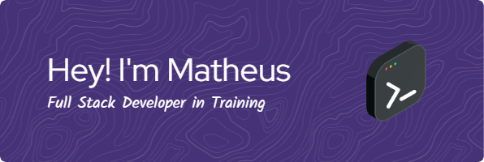

## 👋 Olá, seja bem-vindo ao meu perfil!

Tenho 18 anos e estou no mundo da programação há 2-3 anos. Atualmente cursando Bacharelado em Sistemas de Informação (BSI) com foco em desenvolvimento BackEnd.

## 🚀 Sobre Mim

- ⏩ Atualmente trabalhando em um [**Simulador de Controle Remoto de Dispositivos**](https://github.com/MatheusHeinzen/Controle-Remoto-de-Dispositivos)
- 📚 Foco atual de aprendizagem: **Flask**, **AWS** e **IA**.
- 🏎️ Apaixonado por Fórmula 1
- 🎮 Entusiasta de jogos
- 📖 Amante de mitologia e literatura

## 🛠️ Habilidades Técnicas

### Frontend

  
  
  
  
  
  

### Backend

  
  
  
  

### DevOps & Ferramentas

  
  
  

## 📊 Estatísticas

## 🌐 Conecte-se Comigo

  
  
  

